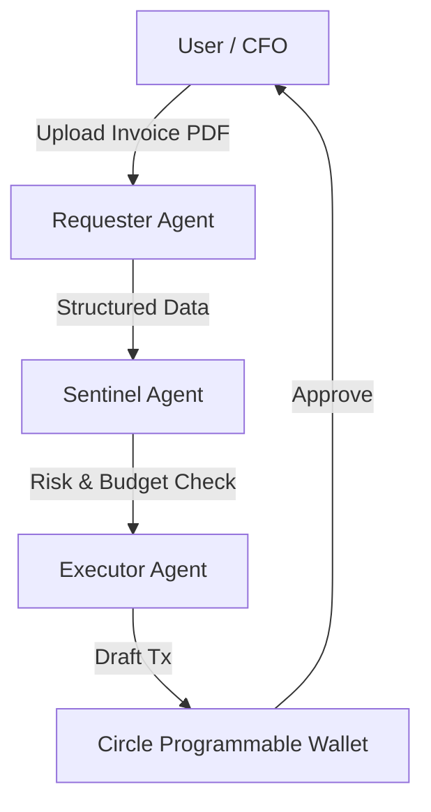

# Tresora

### Autonomous Finance Operations for the Modern Web3 CFO

**Tresora** is a financial automation system designed to eliminate the manual overhead of crypto treasury management. By deploying a swarm of specialized AI agents, it transforms multi-day coordination tasks—like cross-chain invoice payments and compliance checks—into atomic, single-click approvals.

---

## 🏗 System Architecture

The system implements a **Multi-Agent Pattern** orchestrated by **LangGraph**, where discrete agents handle specific domains of the transaction lifecycle. This separation of concerns ensures security, deterministic behavior, and scalability.



### The Agent Swarm

Each agent operates with restricted permissions and specific tooling:

1.  **The Requester (Ingestion Layer)**
    *   **Role:** Parsing unstructured financial data.
    *   **Tech:** `Gemini` + Custom PDF Parsing Pipeline.
    *   **Function:** Ingests PDF invoices, normalizes data schemas, and extracts critical payment details (Amount, Currency, Recipient Address) with near-zero latency.

2.  **The Sentinel (Policy & Security Layer)**
    *   **Role:** Real-time risk assessment and compliance.
    *   **Tech:** `Etherscan API` + `Chainalysis` Heuristics.
    *   **Function:**
        *   **Sanctions Screening:** Verifies recipient addresses against known blacklists.
        *   **Contract Audits:** Checks destination contracts for verification status and suspicious transaction history.
        *   **Market Analysis:** Monitors gas prices and slippage conditions to prevent execution during volatility spikes.

3.  **The Executor (DeFi Operations Layer)**
    *   **Role:** Transaction construction and routing.
    *   **Tech:** `Uniswap V4 SDK` + `Circle CCTP` + `Uniswap v4 Universal Router`.
    *   **Function:**
        *   **Liquidity Routing:** Automatically finds the optimal path for payment. If the treasury holds ETH but owes USDC, it programmatically executes a **Uniswap V4** swap.
        *   **Cross-Chain Bridging:** Utilizes **Circle CCTP (Cross-Chain Transfer Protocol)** to burn-and-mint USDC between Sepolia and Arc Testnet without slippage.
        *   **Drafting:** Constructs the final transaction bundle and queues it in a **Circle Developer-Controlled Wallet** for human signature.

---

## ⚡ Key Technical Features

### State-Machine Execution
Unlike standard chatbots, our agents don't just "chat." They maintain a **Stateful Execution Plan**. The system drafts a multi-step dependency graph (e.g., `Swap` → `Bridge` → `Transfer`) and executes it recursively. If a step fails (e.g., high slippage), the state machine halts and requests human intervention, ensuring no funds are ever lost to race conditions.

### Uniswap V4 Integration
We leverage the **Uniswap V4 Quoter** and **Universal Router** for atomic swaps. This allows the treasury to be asset-agnostic—holding ETH or various stablecoins—while paying vendors in their preferred currency (USDC/EURC) automatically.

### Circle Programmable Infrastructure
Security is paramount. The application **never holds private keys**. All transactions are executed via **Circle's Programmable Wallets**, which enforce policy controls (e.g., "Require approval for > $1000") at the infrastructure level.

---

## 🚀 Getting Started

### Prerequisites
*   Node.js 18+
*   pnpm / yarn / npm
*   Circle Developer Account
*   Google AI Studio Key

### Installation

1.  **Clone the repository**
    ```bash
    git clone https://github.com/ighmaZ/multiplayer-agent-treasury.git
    cd multiplayer-agent-treasury
    ```

2.  **Install dependencies**
    ```bash
    pnpm install
    ```

3.  **Environment Setup**
    Create a `.env.local` file in the root directory:
    ```env
    # AI & Intelligence
    GOOGLE_API_KEY=your_gemini_key

    # Blockchain Data
    ETHERSCAN_API_KEY=your_etherscan_key
    SEPOLIA_RPC_URL=https://rpc.ankr.com/eth_sepolia

    # Circle Infrastructure
    CIRCLE_API_KEY=your_circle_key
    CIRCLE_ENTITY_SECRET=your_entity_secret
    NEXT_PUBLIC_CIRCLE_APP_ID=your_app_id
    ```

4.  **Run Development Server**
    ```bash
    pnpm dev
    ```

---

## 🛠 Technology Stack

### 🧠 Artificial Intelligence (AI) & Agents
*   **Orchestration:** LangGraph (Stateful Multi-Agent Workflows)
*   **LLM:** Gemini(`@google/generative-ai`)
*   **Framework:** LangChain (`@langchain/core`, `@langchain/google-genai`)

### ⛓️ Blockchain & DeFi
*   **Wallet Infrastructure:** Circle Developer-Controlled Wallets (`@circle-fin/developer-controlled-wallets`)
*   **Cross-Chain Bridging:** Circle CCTP (`@circle-fin/bridge-kit`)
*   **Swapping:** Uniswap V4 SDK (`@uniswap/v4-sdk`)
*   **Routing:** Uniswap Universal Router (`@uniswap/universal-router-sdk`)
*   **Client:** Viem (Type-safe Ethereum Interactions)

### 💻 Frontend & UI
*   **Framework:** Next.js 16 (App Router) + React 19
*   **Styling:** Tailwind CSS v4 (`@tailwindcss/postcss`)
*   **Animations:** Framer Motion (`framer-motion`)
*   **Icons:** Lucide React (`lucide-react`)
*   **Notifications:** React Hot Toast (`react-hot-toast`)
*   **Visualizations:** React Flow (`reactflow`)

### 🔧 Utilities
*   **Validation:** Zod (`zod`)
*   **Processing:** PDF Parse / PDF2Pic (Invoice Ingestion)
*   **Security Scanning:** Etherscan API

---

*Built for the [Event Name] Hackathon 2026.*
